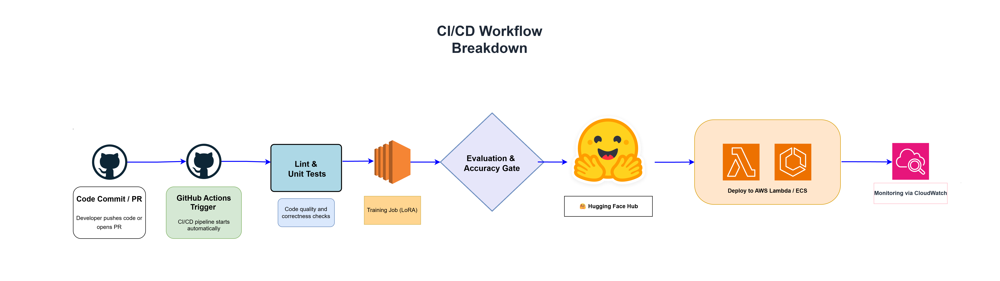
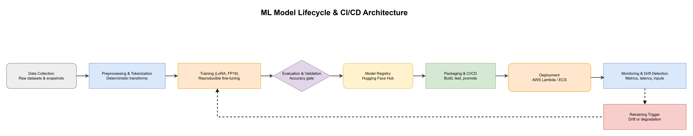
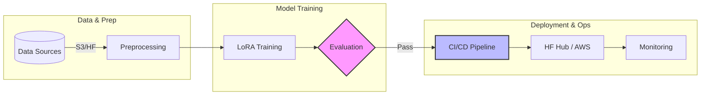

## 🚀 CI/CD Status


[](https://huggingface.co/JeyaPrakashI/distilbert-mlops-demo-ci)
[](https://colab.research.google.com/github/JeyaPrakashI/end-to-end-mlops-pipeline-aws/blob/main/notebooks/demo.ipynb)


# End-to-End MLOps Pipeline (AWS Free Tier)
Zero‑cost, serverless MLOps pipeline with CI/CD, IaC, and monitoring — built on AWS Free Tier + Hugging Face.

---

## 🏗️ Architecture Diagram


## 🔄 CI/CD Workflow


CI/CD Workflow Breakdown
Code Commit / PR → Developer pushes code or opens a pull request

GitHub Actions Trigger → CI/CD pipeline starts automatically

Lint & Unit Tests → Code quality and correctness checks

Training Job (LoRA) → Model fine-tuning with LoRA

Evaluation & Accuracy Gate → Performance validation

Push to Hugging Face Hub → Model versioning and sharing

Deploy to AWS Lambda / ECS → Production deployment

Monitoring via CloudWatch → Real-time metrics and drift detection


## 🔁 Model Lifecycle



---


## 📚 Table of Contents
- [CI/CD Status](#-cicd-status)
- [Project Overview](#-project-overview)
- [Pipeline Stages](#-pipeline-stages)
- [Results](#-results)
- [Training Details](#-training-details)
- [Limitations & Risks](#-limitations--risks)
- [Environmental Impact](#-environmental-impact)
- [Contact](#-contact)
- [Usage](#-usage)

---

## 📌 Project Overview
This project demonstrates a production‑style MLOps pipeline built entirely on free‑tier resources.  
It bridges the gap between **ML research and cloud production**, showing recruiters how modern pipelines can be reproducible, automated, and cost‑efficient.

---

## 🚀 Pipeline Stages
1. **Data ingestion & preprocessing** (S3, Hugging Face Datasets)  
2. **Training** (LoRA fine‑tuning, FP16 mixed precision)  
3. **Evaluation** (accuracy gates, reproducibility checks)  
4. **CI/CD automation** (GitHub Actions workflows)  
5. **Deployment** (Hugging Face Hub, AWS Lambda/ECS)  
6. **Monitoring** (CloudWatch metrics, drift detection)

### Pipeline Diagram 

---

## 📊 Results

| Environment        | Epochs | Train Samples | Eval Samples | Accuracy | Eval Loss | Eval Runtime | Samples/sec | Steps/sec |
|--------------------|--------|---------------|--------------|----------|-----------|--------------|-------------|-----------|
| GitHub Actions (CI/CD) | 2 | 5,000 | 1,000 | **86.0%** | 0.3372 | ~5h | 3.218 | 0.203 |
| Colab GPU (manual) | 3 | 5,000 | 1,000 | **85.3%** | 0.3209 | ~30m | 63.7 | 4.018 |

**Summary:**  
- CI/CD run achieved **86.0% accuracy**, proving automation and reproducibility.  
- Colab run achieved **85.3% accuracy** in ~30 minutes, ideal for rapid iteration.  

- [Model card on Hugging Face](https://huggingface.co/JeyaPrakashI/distilbert-mlops-demo-ci)  
- [Workflow logs](https://github.com/JeyaPrakashI/end-to-end-mlops-pipeline-aws/actions/workflows/train.yml)

---

## ⚙️ Training Details
- **Method:** PEFT (LoRA)  
- **Precision:** FP16 Mixed Precision  
- **Optimizer:** AdamW  
- **Experimental phase:** Rapid iteration on Google Colab (T4 GPU)  
- **Production phase:** Automated training via GitHub Actions runners  

---

## ⚠️ Limitations & Risks
- Inherits biases from DistilBERT’s pretraining corpus (Wikipedia + Toronto Book Corpus).  
- Restricted to English text.  
- Not suitable for sensitive domains (medical, legal, financial) without domain‑specific fine‑tuning.  

---

## 🌱 Environmental Impact
By using LoRA instead of full fine‑tuning:
- Compute requirements reduced by ~90%  
- Lower carbon footprint and operational costs  

---

## 👤 Contact
**Author:** Jeya Prakash I  
**Goal:** Bridging the gap between ML Research and Cloud Production  

---


## 📂 Usage

Clone the repo:
```bash
git clone https://github.com/JeyaPrakashI/end-to-end-mlops-pipeline-aws.git
cd end-to-end-mlops-pipeline-aws
